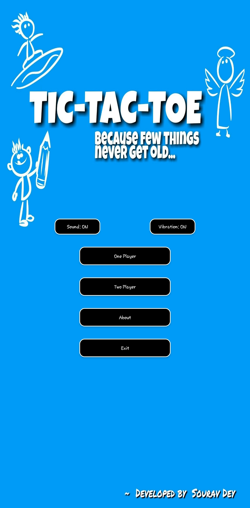

## TicTacToe

### Description

Tic-tac-toe , noughts and crosses (British English), or Xs and Os is a classic paper-and-pencil game for two players, X and O, who take turns marking the spaces in a 3×3 grid. The player who succeeds in placing three of their marks in a horizontal, vertical, or diagonal row is the winner.

This is an Android Application the moves here are played by the device in single player mode are defensive and Random. It is not on MINMAX Algorithm but is capable to make you loose. :smile: Try it.

`Developed on 2016`

### Demo

**[Click here to download the apk](https://drive.google.com/file/d/0BxyUEpBbbGBjSU9udnFQNTd2SUU/view?usp=sharing)**

### Features

	• Simple Android Application
	• Single and Double Player Mode
